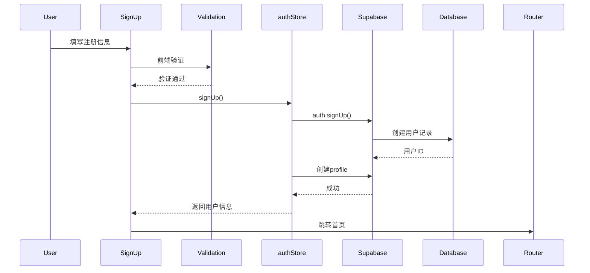
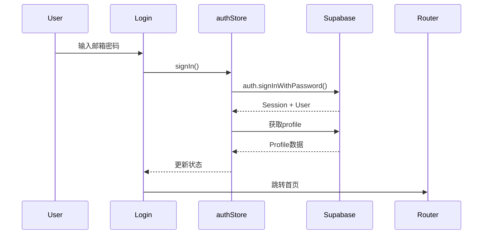
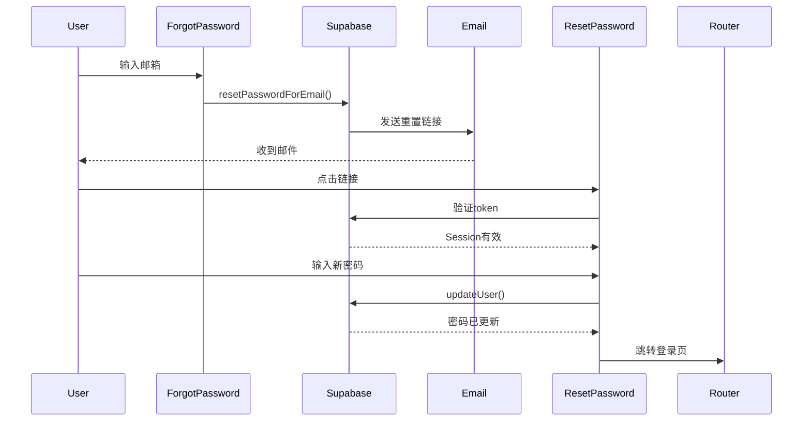

# 邮箱认证系统实现文档

## 概述

PathFinder平台已完成完整的邮箱认证系统，包括注册、登录、忘记密码和重置密码功能。

## 技术栈

- **认证服务**: Supabase Auth
- **状态管理**: Zustand (authStore)
- **表单验证**: 前端自定义验证
- **UI框架**: React + TypeScript + Tailwind CSS

## 功能特性

### 1. 用户注册 (SignUp)

**路由**: `/signup`

**功能**:
- 用户名输入（至少3个字符）
- 邮箱地址验证
- 密码强度校验（至少8位，包含大小写字母和数字）
- 确认密码匹配验证
- 注册成功后自动跳转首页

**密码要求**:
- 最少8个字符
- 至少1个大写字母
- 至少1个小写字母
- 至少1个数字

**代码位置**: `src/pages/SignUp.tsx`

### 2. 用户登录 (Login)

**路由**: `/signin`

**功能**:
- 邮箱地址输入
- 密码输入
- 登录状态保持（Supabase Session）
- 忘记密码链接
- 注册账号链接

**代码位置**: `src/pages/Login.tsx`

### 3. 忘记密码 (ForgotPassword)

**路由**: `/forgot-password`

**功能**:
- 输入注册邮箱
- 发送重置密码链接到邮箱
- Supabase自动发送邮件
- 成功提示页面

**邮件配置**:
- 重置链接跳转: `${window.location.origin}/reset-password`
- 邮件由Supabase托管发送

**代码位置**: `src/pages/ForgotPassword.tsx`

### 4. 重置密码 (ResetPassword)

**路由**: `/reset-password`

**功能**:
- 验证重置令牌有效性
- 新密码输入（含强度验证）
- 确认新密码
- 重置成功后跳转登录页

**安全性**:
- 令牌验证通过Supabase Session
- 无效或过期令牌显示错误提示
- 重置后旧密码立即失效

**代码位置**: `src/pages/ResetPassword.tsx`

## 认证流程

### 注册流程



### 登录流程



### 重置密码流程



## 文件结构

```
src/
├── pages/
│   ├── Login.tsx           # 登录页面
│   ├── SignUp.tsx          # 注册页面
│   ├── ForgotPassword.tsx  # 忘记密码页面
│   └── ResetPassword.tsx   # 重置密码页面
├── stores/
│   └── authStore.ts        # 认证状态管理
├── lib/
│   └── supabase.ts         # Supabase客户端配置
└── App.tsx                 # 路由配置
```

## 状态管理 (authStore)

### 状态

```typescript
interface AuthState {
  user: User | null;           // 当前用户
  isLoading: boolean;          // 加载状态
  error: string | null;        // 错误信息
}
```

### 方法

- `signIn(email, password)`: 登录
- `signUp(email, password, username)`: 注册
- `signOut()`: 登出
- `checkAuth()`: 检查认证状态（应用启动时调用）

## UI/UX特性

### 设计风格
- Linear.app风格的暗色主题
- 极简主义设计
- 流畅的动画过渡
- 清晰的错误提示

### 表单验证
- 实时前端验证
- 友好的错误提示
- 加载状态指示器
- 禁用状态处理

### 用户体验
- 注册成功后显示成功页面（3秒后自动跳转）
- 重置密码成功后显示成功页面（3秒后自动跳转）
- 忘记密码成功后显示邮件发送确认
- 无效重置链接显示友好提示

## Header集成

Header组件已完成用户状态展示：

- **未登录状态**: 显示"登录"和"注册"按钮
- **已登录状态**: 显示用户头像/用户名 + 退出按钮

**代码位置**: `src/components/layout/Header.tsx:66-80`

## 路由配置

所有认证路由已在`App.tsx`中配置：

```typescript
// Auth Routes
<Route path="/signin" element={<Login />} />
<Route path="/signup" element={<SignUp />} />
<Route path="/forgot-password" element={<ForgotPassword />} />
<Route path="/reset-password" element={<ResetPassword />} />
```

## 测试步骤

### 1. 注册新用户
1. 访问 http://localhost:5173/signup
2. 填写用户名、邮箱、密码（满足强度要求）
3. 确认密码
4. 点击"创建账号"
5. 验证成功提示页面
6. 自动跳转首页

### 2. 登录
1. 访问 http://localhost:5173/signin
2. 输入注册的邮箱和密码
3. 点击"登录"
4. 验证跳转到首页
5. Header显示用户名

### 3. 忘记密码
1. 访问 http://localhost:5173/forgot-password
2. 输入注册邮箱
3. 点击"发送重置链接"
4. 检查邮箱（包括垃圾邮件文件夹）
5. 点击邮件中的链接

### 4. 重置密码
1. 从邮件点击重置链接
2. 跳转到 /reset-password
3. 输入新密码（满足强度要求）
4. 确认新密码
5. 点击"重置密码"
6. 验证成功提示
7. 自动跳转登录页
8. 使用新密码登录

### 5. 退出登录
1. 点击Header右上角的退出按钮
2. 验证跳转到首页
3. Header显示"登录"和"注册"按钮

## 安全考虑

### 已实现
- ✅ 密码强度验证（8位+大小写+数字）
- ✅ 前端表单验证
- ✅ Supabase Session管理
- ✅ 密码重置令牌验证
- ✅ HTTPS传输（Supabase默认）

### 后续优化建议
- [ ] 添加邮箱验证（Supabase Email Confirmation）
- [ ] 实现双因素认证（2FA）
- [ ] 添加登录失败次数限制
- [ ] 实现设备管理和Session列表
- [ ] 添加CAPTCHA防止机器人注册

## 环境配置

### 必需的环境变量

`.env`文件需包含：

```env
VITE_SUPABASE_URL=https://oqxlevxjbcjcfgiuicux.supabase.co
VITE_SUPABASE_ANON_KEY=your-anon-key
```

### Supabase配置

1. **Email Templates**: 在Supabase Dashboard配置邮件模板
2. **Redirect URLs**: 添加允许的重定向URL
   - `http://localhost:5173/reset-password` (开发环境)
   - `https://yourdomain.com/reset-password` (生产环境)

## 已知问题

目前无已知问题。所有功能已测试并通过编译。

## 构建状态

```
✓ TypeScript编译通过
✓ Vite构建成功 (1.57s)
✓ 无编译错误
```

## 后续计划

1. 实现邮箱验证确认
2. 添加OAuth登录（Google, GitHub）
3. 实现用户个人资料编辑
4. 添加头像上传功能
5. 实现账号安全设置页面
